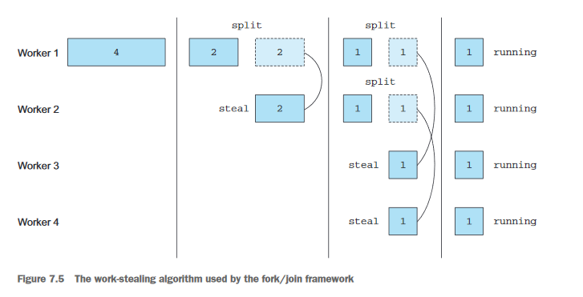

## Best practices for using fork/join framework

Even though the fork/join framework is relatively easy to use, unfortunately it's also easy to misuse. Here are a few best practices using it effectively:

- Invoking the join method on a task blocks the caller until the result produced by that task is ready. For this reason, it's necessary to call it after the computation of both subtasks has been started. Otherwise, you'll end up with a slower and more complex version of you original sequential algorithm because every subtask will have to wait for the other one to complete before starting.

- The invoke  method  of  a  ForkJoinPool  shouldn't  be  used  from  within  aRecursiveTask.  Instead,  you  should  always  call  the  methods  compute  or  fork directly; only sequential code should use invoke to begin parallel computation.

- Calling  the  fork  method  on  a  subtask  is  the  way  to  schedule  it  on  the  Fork-JoinPool.  It  might  seem  natural  to  invoke  it  on  both  the  left  and  right  sub-tasks,  but  this  is  less  efficient  than  directly  calling  compute  on  one  of  them. Doing this allows you to reuse the same thread for one of the two subtasks and avoid the overhead caused by the unnecessary allocation of a further task on the pool. 

- Debugging a parallel computation using the fork/join framework can be tricky.In particular, it’s ordinarily quite common to browse a stack trace in your favor-ite IDE to discover the cause of a problem, but this can’t work with a fork/join computation because the call to compute occurs in a different thread than the conceptual caller, which is the code that called fork.

- As you’ve discovered with parallel streams, you should never take for granted that a computation using the fork/join framework on a multicore processor is faster than the sequential counterpart. We already said that a task should be decomposable into several independent subtasks in order to be parallelizable with a relevant performance gain. All of these subtasks should take longer to execute than forking a new task; one idiom is to put I/O into one subtask and computation into another, thereby overlapping computation with I/O. More-over, you should consider other things when comparing the performance of the  sequential  and  parallel  versions  of  the  same  algorithm.  Like  any  otherJava code, the fork/join framework needs to be “warmed up,” or executed, a few times before being optimized by the JIT compiler. This is why it’s always important  to  run  the  program  multiple  times  before  to  measure  its  performance, as we did in our harness. Also, be aware that optimizations built into the  compiler  could  unfairly  give  an  advantage  to  the  sequential  version  (for example, by performing dead code analysis—removing a computation that’s never used).

The  fork/join  splitting  strategy  deserves  one  last  note:  you  must  choose  the  criteria used to decide if a given subtask should be further split or is small enough to be evaluated sequentially. We’ll give some hints about this in the next section.

It should now be clear how a stream can use the fork/join framework to process its items in parallel, but there’s still one missing ingredient. In this section, we analyzed an example where you explicitly developed the logic to split an array of numbers into multiple tasks. Nevertheless, you didn't have to do anything similar when you used the parallel streams at the beginning of this chapter, and this means that there must be an automatic mechanism splitting the stream for you. This new automatic mechanism is called the Spliterator, and we’ll explore it in the next section.

