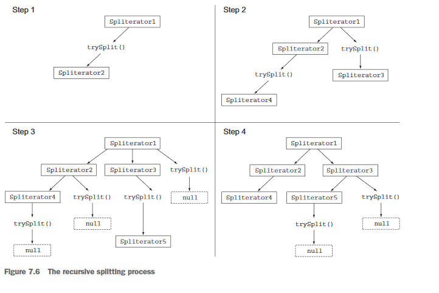
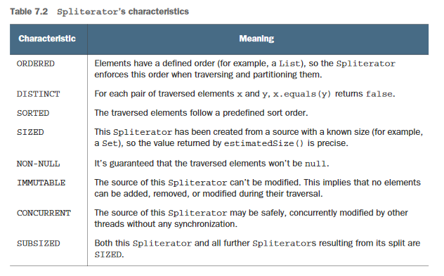

## The splitting process

The algorithm that splits a stream into multiple parts is a recursive process and proceeds as shown in figure 7.6. In the first step, trySplit is invoked on the Spliterator and generates a second one. Then in step two, it's called again on these two Spliterators, which results in a total of four. The framework keeps invoking the methods trySplit on a Spliterator until is returns null to signal that the 

data structures that it's processing is no longer divisible, as shown in step 3. Finally, this recursive splitting process terminates in step 4 when all Spliterators have returned null to a trySplit invocation.

This splitting process can also be influenced by the characteristics of the Spliterator itself. The Spliterator clients can use these characteristics to better control and optimize its usage. Table 7.2 summarizes them. (Unfortunately, although these conceptually overlap with characteristics of a collector, they're coded differently.) The characteristics are int constants defined in the Spliterator interface.

Now that you've seen what the Spliterator interface is and which methods it defines, you can try to develop you own implementation of a Spliterator.

